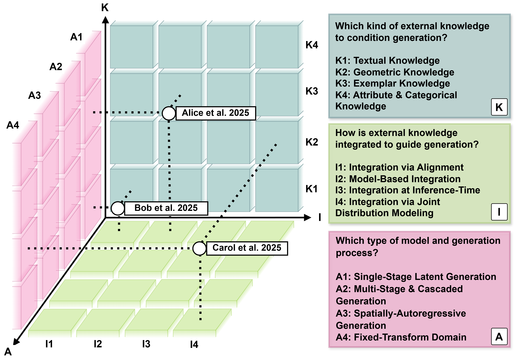

# Knowledge-Guided 3D CT Generation: A Conditioning-Centric Taxonomy

<div align="center">

[](https://arxiv.org/abs/XXXX.XXXXX)
[](LICENSE)
[](https://gemini.google.com/gem/1NveJGT-FX98ddXRWIsfajtC4X1OnI-4Y?usp=sharing)

**Francesca Pia Panaccione, Eugenio Lomurno, Matteo Matteucci**
*Politecnico di Milano, 2025*

<br>

<br>

</div>

## 📌 Overview
This repository hosts the resources for the survey **"Knowledge-Guided 3D CT Generation: A Conditioning-Centric Taxonomy"**.

We introduce the first taxonomy that organizes generative methods not by architecture, but by **how external knowledge conditions the synthesis**. This defines a design space **$K \times I \times A$** to systematically compare methods and identify future research directions.

> 📄 **For the full analysis, definitions, and comprehensive literature review, please refer to the [Paper](https://arxiv.org/abs/XXXX.XXXXX).**

---

## 📐 The Design Space ($K \times I \times A$)

We factorize each method into a tuple $(k, i, a)$ based on three orthogonal axes.

### **Axis K: External Knowledge**
*What type of information guides the generation?*

| Symbol | Category | Definition |
| :---: | :--- | :--- |
| **K1** | **Textual** | Natural language descriptions (reports, prompts). |
| **K2** | **Geometric** | Spatial constraints (segmentation masks, landmarks). |
| **K3** | **Exemplar** | Reference volumes from other modalities (e.g., MRI $\to$ CT). |
| **K4** | **Attribute** | Non-spatial metadata (demographics, class labels). |

### **Axis I: Knowledge Integration**
*How is the guidance injected into the model?*

| Symbol | Category | Definition |
| :---: | :--- | :--- |
| **I1** | **Alignment** | Embedding space alignment (e.g., CLIP). |
| **I2** | **Model-Based** | Direct architectural injection (Cross-Attn, ControlNet). |
| **I3** | **Inference-Time** | Sampling-time guidance (e.g., Classifier-Free Guidance). |
| **I4** | **Joint** | Joint probability modeling $p(x, k)$. |

### **Axis A: Generative Architecture**
*What is the backbone synthesis mechanism?*

| Symbol | Category | Definition |
| :---: | :--- | :--- |
| **A1** | **Single-Stage** | Latent space synthesis (LDM, VQ-VAE). |
| **A2** | **Cascaded** | Multi-stage refinement (Coarse $\to$ Fine). |
| **A3** | **Autoregressive** | Sequential token/slice generation. |
| **A4** | **Transform** | Fixed spectral/wavelet domain generation. |

---

## 🔍 Key Insights

Based on our analysis of 25+ state-of-the-art methods:

* **Dominant Paradigm**: **Geometric conditioning (K2)** is the most prevalent approach (**44%** of methods), typically integrated via model-based mechanisms (**I2**) in single-stage latent models (**A1**).
* **Research Gaps**:
    * **Demographic conditioning (K4)** is utilized in only **6%** of methods.
    * **Joint modeling (I4)** remains underexplored (**10%**), presenting opportunities for co-generation tasks.
* **Design Patterns**: Inference-time guidance (**I3**) is currently employed **exclusively** in text-conditioned methods (**K1**).

---

## 🤖 Method Classifier

Unsure where your method fits? We provide an automated tool to position your work within the $K \times I \times A$ topology.

* **[Try the Gemini Classifier ↗](https://gemini.google.com/gem/1NveJGT-FX98ddXRWIsfajtC4X1OnI-4Y?usp=sharing)**

---

## 📖 Citation

```bibtex
@article{panaccione2025taxonomy,
  title={Knowledge-Guided 3D CT Generation: A Conditioning-Centric Taxonomy},
  author={Panaccione, Francesca Pia and Lomurno, Eugenio and Matteucci, Matteo},
  journal={arXiv preprint arXiv:XXXX.XXXXX},
  year={2025}
}
```

---

## 📜 License

This project is licensed under the MIT License - see the [LICENSE](LICENSE) file for details.

---

## 🙏 Acknowledgments

This work is supported by the FAIR (Future Artificial Intelligence Research) project, funded by the NextGenerationEU program within the PNRR-PE-AI scheme (M4C2, investment 1.3, line on Artificial Intelligence).

---

## 📬 Contact

For questions or collaboration:
- **Francesca Pia Panaccione**: francescapia.panaccione@polimi.it
- **Eugenio Lomurno**: eugenio.lomurno@polimi.it
- **Matteo Matteucci**: matteo.matteucci@polimi.it

---

Made with ❤️ at Politecnico di Milano

